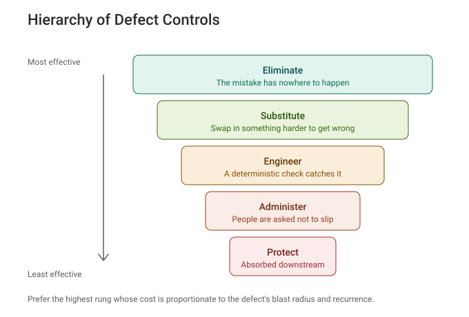

# Hierarchy of Defect Controls

A ranking of software fixes from most to least effective, lifted from the occupational-safety Hierarchy of Controls. The top rungs work whether or not anyone is paying attention; the bottom rungs work only while someone remembers. This repo is the framework, a drop-in `CLAUDE.md`, and a Claude Code plugin that applies the ladder to Claude's own repeated mistakes.

## Install

The repo is a Claude Code plugin marketplace. In Claude Code:

    /plugin marketplace add odclcslkrpb5k/hierarchy-of-defect-controls
    /plugin install hierarchy-of-defect-controls@hdc

Restart or `/reload-plugins`, then `/hooks` should list four plugin hooks. Requires `python3` on `PATH`; `git` is used for working-tree fingerprinting when present.

To try it without installing, clone and run `claude --plugin-dir /path/to/clone`. To get the rules into every session regardless of skill matching, copy [`docs/CLAUDE.md`](docs/CLAUDE.md) into your project.

## What the plugin does

Three controls, each labelled at the rung it actually occupies:

- **Gate** (Engineer, narrow). A `PreToolUse` hook denies a call identical to one that has already failed twice with the same error when nothing has changed since: no edit, no working-tree change, no new commit. A new user message reopens it.
- **No-op edit detector** (Engineer for the retry loop, Administer for the no-op itself). A `sed -i` or `perl -pi` that reports success while leaving its files byte-identical is recorded as a failure, so the gate blocks an identical retry.
- **Reminder** (Administer). When the same failure signature recurs, a factual note asks Claude to name the rung of its remedy and the next rung up. The count survives context compaction.

Plus indicators, an analog of the process-safety standard API RP 754: `python3 scripts/hdc_report.py` reads Claude Code's transcripts and reports how often each control was called on, grouped into episodes, against tool calls made. An opt-in log (`HDC_EVENTS`) records the hooks themselves failing. Nothing it measures is shown to Claude. What the numbers can and cannot say: [`docs/indicators.md`](docs/indicators.md).

There is deliberately no hook that reads Claude's prose for admissions of a repeated mistake. That design gates on disclosure, which prices honesty; see the reviews.

Full component table, gate rules, tuning and known gaps: [`docs/plugin.md`](docs/plugin.md).

## The ladder

1. **Eliminate** - the mistake has nowhere to happen
2. **Substitute** - swap in something harder to get wrong
3. **Engineer** - a deterministic check catches it
4. **Administer** - people are asked not to slip
5. **Protect** - the defect ships and is absorbed downstream

Prefer the highest rung whose cost is proportionate to the defect's blast radius and recurrence. Name the rung of every fix, and the next rung up with the reason it was not chosen. Full framework with examples for code, analysis and operations: [`docs/hierarchy-of-defect-controls.md`](docs/hierarchy-of-defect-controls.md).

## How it was built

Five rounds of adversarial review by a separate Claude Code session, each run against a live session with a payload logger. Every round is in [`docs/reviews/`](docs/reviews/), and [`CHANGELOG.md`](CHANGELOG.md) records the response to each. The package was held to its own framework throughout: two components were relabelled, one was removed under the repo's own rule for retiring a narrow gate, and a Stop-time prose reviewer was deleted in round 1 and never re-added.

## Test

    python3 test/run_tests.py

69 tests: hooks simulated tool call by tool call the way Claude Code does (gate, real command, then success or failure), and the report run against a captured transcript. Fixtures in `test/fixtures/` are captured payloads from a real session; re-capture after a Claude Code upgrade, since a renamed field fails as silent always-pass.

## Layout

    .claude-plugin/     plugin.json and marketplace.json (the repo is both)
    hooks/hooks.json    four hooks wired to scripts/hdc_hooks.py
    scripts/            hdc_hooks.py (the hooks) and hdc_report.py (indicators); no dependencies
    skills/             the rules as a Claude Code skill
    docs/               framework, CLAUDE.md, plugin reference, indicators, the SVG, reviews
    test/               test suite and captured fixtures

## License

MIT.
